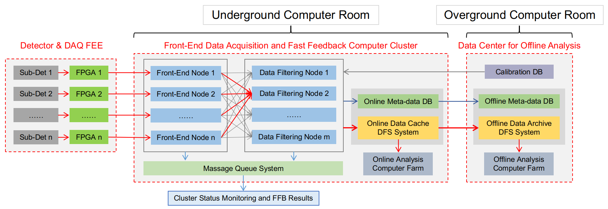

# DiffraFlow

**Diffra**ction image data **Flow**, aiming at the high throughput streaming data acquisition and online analysis for pixel array detectors.

Started on 12th September 2019 by Zhengheng Li after he joined BE-SHINE, this project is proposed to develop a highly optimized distributed software system that can run on a very large compute cluster for streaming the data from pixel array detectors to distributed file system at a very high overall input data throughput (e.g. >100GiB/s).

The software should be capable of doing online event-building for all events before data saving, as well as doing online calibration, deep event filtering and quasi-realtime analysis for fast feedback based on full event image data. CUDA technology will be applied to accelerate the data processing speed using GPUs.

The overall design of data flow is schematically shown below, and more details will be in docs and wiki.

The overall design looks similar to LCLS-II's (see: <https://ieeexplore.ieee.org/document/8533033>). While the difference could be that this design uses a MapReduce-like data shuffling process to do the online event-building, which will make it easier to do online data filtering and the following science analysis based on event data.

This project is currently under developing and still at the prototype stage.
