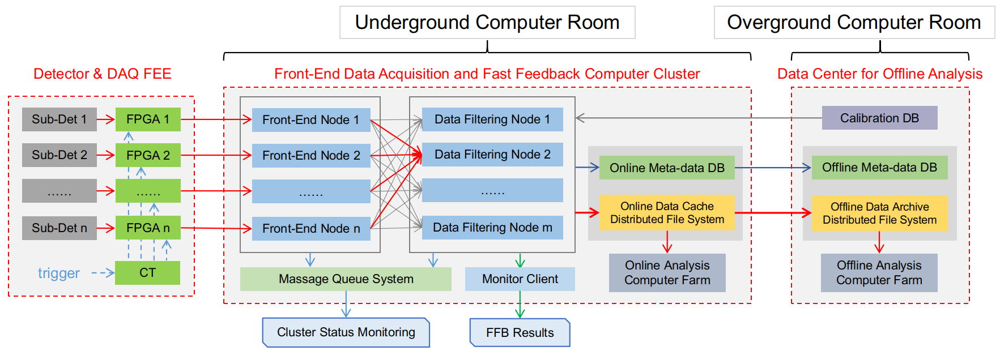
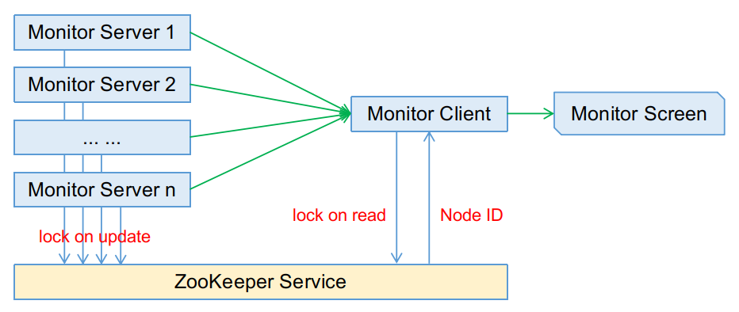

# DiffraFlow

High volume data acquisition and online analysis system for SHINE project

## dependencies

1. dispatcher:  
    (1) org.apache.kafka:kafka-clients:2.3.0

2. combiner:  
    (2) https://github.com/edenhill/librdkafka (v1.2.0)

## blueprint

## online event-building

## dispatcher

## combiner

## ingester and monitor

## subsecond FFB

