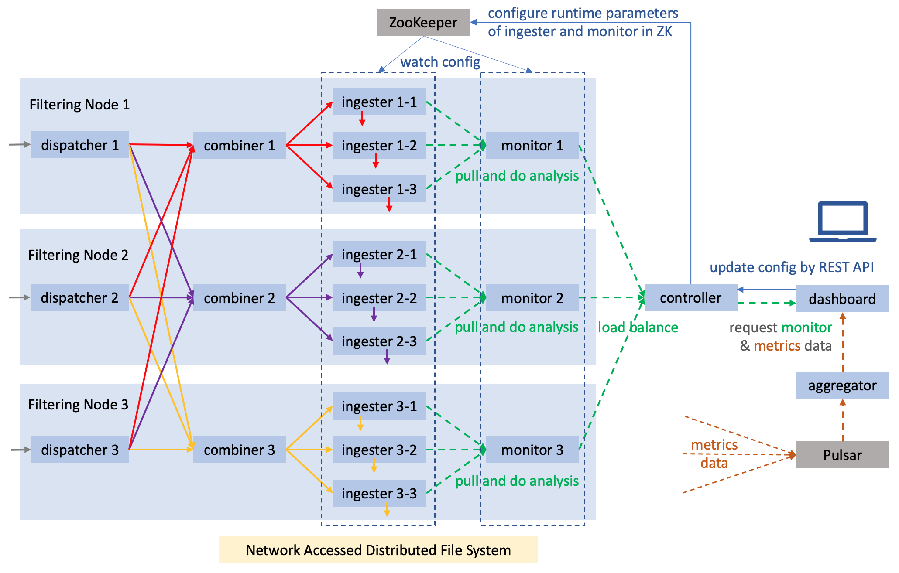

# Documents of this project

## Installation

1. Install dependencies  
   * For Ubuntu:  

   ```bash
    # Boost C++ Library, Google Snappy, LZ4, ZSTD, Apache log4cxx, MessagePack, ZooKeeper, C++ Rest SDK, HDF5
    sudo apt install libboost-dev libsnappy-dev liblz4-dev libzstd-dev liblog4cxx-dev libmsgpack-dev libzookeeper-mt-dev libcpprest-dev libhdf5-dev
    # Pulsar Client
    wget https://archive.apache.org/dist/pulsar/pulsar-2.5.0/DEB/apache-pulsar-client.deb
    sudo dpkg -i apache-pulsar-client.deb
    wget https://archive.apache.org/dist/pulsar/pulsar-2.5.0/DEB/apache-pulsar-client-dev.deb
    sudo dpkg -i apache-pulsar-client-dev.deb
   ```

   * For Mac OS:  

   ```bash
    # Boost C++ Library, Google Snappy, LZ4, ZSTD, Apache log4cxx, MessagePack, ZooKeeper, C++ Rest SDK, Pulsar Client, HDF5
    brew install boost snappy lz4 zstd log4cxx msgpack zookeeper cpprestsdk libpulsar hdf5
   ```

2. Compile and install  
   * For debug variant:

   ```bash
    ./gradlew build
   ```

   then all binaries of debug variant will be compiled and installed in build/package_debug.  

   * For release variant:

   ```bash
    ./gradlew packageRelease
   ```

   then all binaries of release variant will be compiled and installed in build/package_release.

## Architecture

This picture shows the architecture designing details of the data flow from source to sink and the strategy for online analysis.



